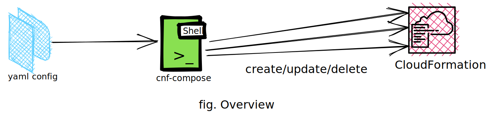

[](https://goreportcard.com/report/github.com/rbalman/cfn-compose)
[](https://sonarcloud.io/summary/new_code?id=cfn-compose)
[](https://sonarcloud.io/summary/new_code?id=cfn-compose)
[](https://sonarcloud.io/summary/new_code?id=cfn-compose)
[](https://sonarcloud.io/summary/new_code?id=cfn-compose)
[](https://sonarcloud.io/summary/new_code?id=cfn-compose)

# cfnc

A command-line tool for managing CloudFormation Stacks at scale.

## Features

- Create/Update/Delete multiple CloudFormation stacks in parallel or sequentially
- Customize the CloudFormation stacks dependency using yaml config
- Delete multiple CloudFormation stacks respecting the creation sequence
- DryRun mode to plan the change
- Generate/Validate/visualize configuration with ease
- Supports Go Template for dynamic value substitution

https://user-images.githubusercontent.com/8892649/216241617-9aef4f3c-2981-4b36-a4da-41eec0e6b1e7.mp4/

## Overview

As the infrastructure evolves and gets complicated we need to manage/maintain multiple CloudFormation Stacks. When we want to `create/update/delete` these stacks we need to manually apply the actions one at a time. Deletion mostly in dev/test environment can be hectic as we should delete the stacks in the reverse of creation order. **cfnc** helps to manage multiple stacks that are closely related using declarative language.



## Usage

```shell
➜ cfnc --help
Manage cloudformation stacks at scale. Design and deploy multiple cloudformation stacks either in sequence or in parallel using declarative configuration

Usage:
  cfnc [command]

Available Commands:
  completion  Generate the autocompletion script for the specified shell
  config      Generate, validate and visualize the compose configuration
  deploy      Deploys the stacks based on the sequence specified in the compose configuration
  destroy     Destroys all the stacks in the reverse order of creation
  help        Help about any command

Flags:
  -c, --config string     File path to compose file (default "cfn-compose.yml")
  -d, --dry-run           Run commands in dry run mode
  -h, --help              help for cfnc
  -l, --loglevel string   Specify Log Levels. Valid Levels are: DEBUG, INFO, WARN, ERROR (default "INFO")
  -v, --version           version for cfnc

Use "cfnc [command] --help" for more information about a command.
```

#### Examples

```shell
## Deploy
cfnc deploy
## Deploy in dry run mode
cfnc deploy -d

## Destroy
cfnc destroy
## Destroy in dry run mode
cfnc destroy -d

## Generate Validate and Visualize compose configuration
cfnc config generate
cfnc config validate
cfnc config visualize
```

## Limitations
* Supports limited CFN attributes
* No Retry Mechanism
* No Configurable worker pool. One Go routine is spun for every flow.
* Single Compose Configuration can only have up to 50 flows and each flow can contain only upto 50 stacks

## Installation
Binary is available for Linux, Windows and Mac OS (amd64 and arm64). Download the binary for your respective platform from the [releases page](https://github.com/rbalman/cfn-compose/releases).

Using go cli
```shell
go install github.com/rbalman/cfn-compose@latest
```

## Man

| Command               | Options          | Description                                                                     |
| --------------------- | ---------------- | ------------------------------------------------------------------------------- |
| cfnc                  | -h, --help, help | Get description of cfnc                                                         |
| cfnc                  | -d, --dry-run    | enable dry run mode                                                             |
| cfnc                  | -l, --loglevel   | Specify Log Levels. Valid Levels are: DEBUG, INFO, WARN, ERROR (default "INFO") |
| cfnc                  | -c, --config     | File path to compose file (default "cfn-compose.yml")                           |
| cfnc deploy           | with no flag     | deploys all the stacks                                                          |
| cfnc deploy           | -f, --flow       | Cherry pick specific flow to deploy                                             |
| cfnc destroy          | with no flag     | destroys all the stacks                                                         |
| cfnc destroy          | -f, --flow       | Cherry pick specific flow to destroy                                            |
| cfnc config generate  | no flags         | Generates compose template                                                      |
| cfnc config validate  | no flags         | Validates the compose configuration                                             |
| cfnc config visualize | no flags         | Visualize the stacks dependencies and creation order                            |
| cfnc                  | -v, --version    | version for cfnc                                                                |

## Documentation
**Sample Config File:**

```yaml
Description: Sample CloudFormation Compose file
Vars:
  Key: Value
Flows:
  Flow1:
    Order: 0
    Description: Flow1 Description
    Stacks:
      - Stack1
      - Stack2
  Flow2:
    Order: 1
    Description: Flow2 description
    Stacks:
      - Stack1
      - Stack2
```

A typical compose configuration contains:

- Optional `Description`
- Optional `Vars` section to define variables in `Key: Value` mapping
  eg:

```yaml
Vars:
  ENV_TYPE: 'nonproduction'
  ENV_NAME: 'demo'
  AWS_PROFILE: 'demo'
```

- Mandatory `Flows:` section
  `Flow` is a collection of CloudFormation stacks that are deployed sequentially. `Flows` is collection of flows which can be ordered using `Order` property. `Flows` can run in parallel or sequentially based on the Order property.
  - Optional `Order` can be any `unsigned` integer. Default `Order` is set to `0`. Flow with lowest orders are deployed first.
  - Optional `Description`
  - Mandatory `Stacks` which is the collection of CFN stack. Below are the supported attributes of the stack object
    - mandatory `template_file` or `template_url` (only s3 url)
    - mandatory `stack_name`
    - optional `capabilities`
    - optional `parameters`
    - optional `tags`
    - optional `tags`

**Sample:**

```yaml
Description: Sample CloudFormation Compose file
Vars:
  ENV_NAME: cfnc
  ENV_TYPE: nonproduction
Flows:
  SecurityGroup:
    Order: 0
    Description: Creates SecurityGroup
    Stacks:
      - template_file: <cfn-template-path>
        stack_name: stack-name1
        parameters:
          EnvironmentName: '{{ .ENV_NAME }}'
          EnvironmentType: '{{ .ENV_TYPE }}'
        tags:
          EnvironmentName: '{{ .ENV_NAME }}'
          EnvironmentType: '{{ .ENV_TYPE }}'

  EC2Instance:
    Order: 1
    Description: Deploying EC2 Instance
    Stacks:
      - template_file: <cfn-template-path>
        stack_name: stack-name2
        parameters:
          EnvironmentName: '{{ .ENV_NAME }}'
          EnvironmentType: '{{ .ENV_TYPE }}'
        tags:
          EnvironmentName: '{{ .ENV_NAME }}'
          EnvironmentType: '{{ .ENV_TYPE }}'
```

Please consult examples for quick start [ec2-sg example](examples/ec2-sqs/Readme.md) and [demo ec2-sqs-rds example](examples/demo/Readme.md)

## Contribution
<a href="https://github.com/rbalman/cfn-compose/graphs/contributors">
  
</a>

There is a lot of room for enhancements and you are more than welcome to contribute. If you have any concerns, recommendations, ideas feel free to [create issues](https://github.com/rbalman/cfnc/issues) or [create PR](https://github.com/rbalman/cfnc/pulls).
[Details Example](examples/ec2-sqs/Readme.md)
